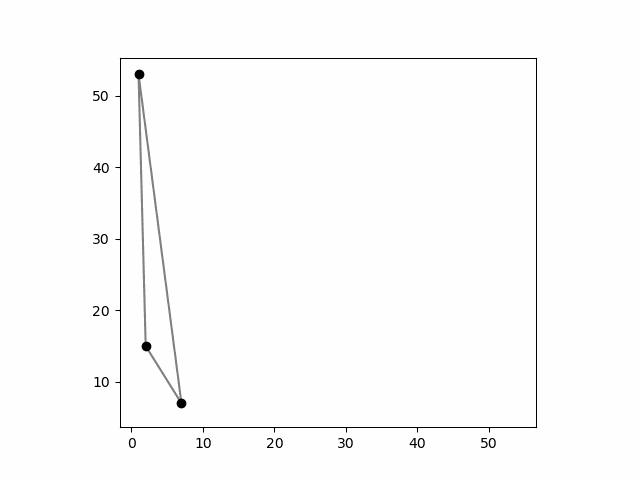
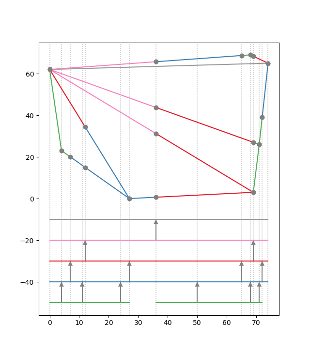
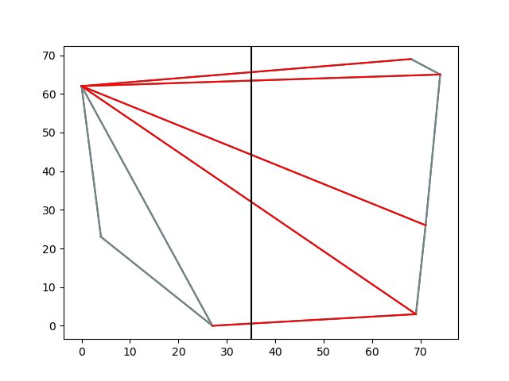
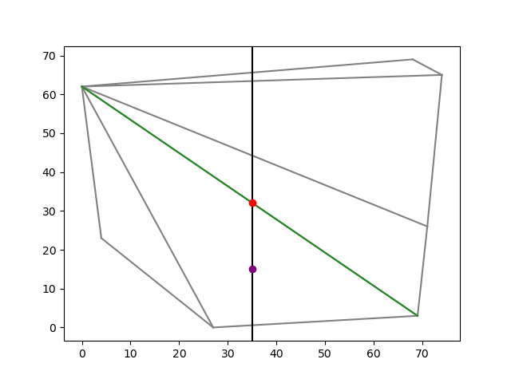

Project for CS 290: Computational Geometry. This project implements components of a point location data structure and randomized incremental algorithm for computing Delaunay triangulations.

### Naive Delaunay

An animation of a `Triangulation` being constructed, following by the insertion of all points not on its convex hull. As points are inserted via `insert_point()` by `random_incremental()`, the point-location query and new segments are shown. Finally, the potential edge flips considered during `naive_delaunay()` are shown, eventually resulting in the final Delaunay triangulation of the points.

### Fast RIC Construction

An animation of a `Triangulation` being constructed, following by the insertion of all points not on its convex hull. As points are inserted via `insert_point()` by `random_incremental()`, the point-location query and new segments are shown. Furthermore, the edges are recursively flipped as appropriate by calling `legalize()` on them, which guarantees the triangulation is Delaunay immediately after each iteration of `random_incremental()`.

### Segment Tree

A triangulation of a convex hull, whose segments of its edges are colored by the corresponding nodes of the segment tree, shown below it. The vertical dotted lines contain the endpoints of the edges, which is what the segment tree is constructed over. A gray arrow upwards from a colored segment of the segment tree shows where the parent segment was split into two children. In this example, exactly one edge of the triangulation spans the entire set and is stored at the root, namely the upper grey edge.

<!--  -->

A triangulation of a convex hull (grey), a query point (purple) in one of its triangles, the lowest triangle edge above the query point (green), and the visible point on that segment (red).
