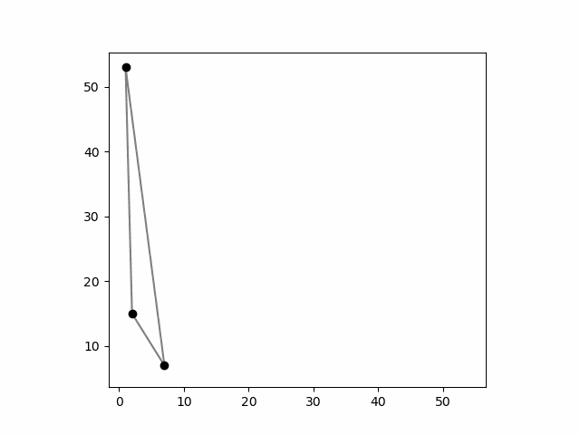

# Project 4: Delaunay Triangulations

This is the fourth project for CS 290: Computational Geometry at Duke University, fall 2024.

## Change Log
- no changes yet

## Table of Contents
- [Project 4: Delaunay Triangulations](#project-4-delaunay-triangulations)
  - [Change Log](#change-log)
  - [Table of Contents](#table-of-contents)
  - [Important Dates](#important-dates)
  - [Goals](#goals)
  - [System Requirements](#system-requirements)
  - [Organization](#organization)
    - [Helper Files](#helper-files)
  - [Figures](#figures)
    - [Task 0: Getting Started](#task-0-getting-started)
    - [Task 1: Naive Delaunay](#task-1-naive-delaunay)
    - [Task 2: Fast RIC Construction](#task-2-fast-ric-construction)
    - [Task 3: Segment Tree](#task-3-segment-tree)
  - [Submitting to Gradescope](#submitting-to-gradescope)
  - [Task 0: Getting Started (5%)](#task-0-getting-started-5)
  - [Task 1: Naive Delaunay via Naive Ray Shooting (30%)](#task-1-naive-delaunay-via-naive-ray-shooting-30)
  - [Task 2: Legalize (15%)](#task-2-legalize-15)
  - [Task 3: Point Location via Segment Trees (30%)](#task-3-point-location-via-segment-trees-30)
  - [Task 4: Analysis (20%)](#task-4-analysis-20)
    - [**WARNING**: The analysis should be done with DRAW=False when constructing Triangulations!](#warning-the-analysis-should-be-done-with-drawfalse-when-constructing-triangulations)

## Important Dates
- Friday 11/15: Project released
- Wednesday 11/20: *Limited* Autograder on Gradescope
- Sunday 11/24 @ 11:59pm: Progress report **due** (make a private post on Ed with subject "Check-In")
- Sunday 12/1 @ 11:59pm: Project **due**

## Goals
For this project you will implement components of a point location data structure and randomized incremental algorithm for computing Delaunay triangulations.

## System Requirements

This project leverages more packages than in the past. If you are using the Anaconda distribution then these should already be installed. If not, you can install them with `pip`:

`pip install matplotlib scipy pillow`

Depending on how your Python installation is set up on your system, you may need to ensure that `pip` has been installed and is on your PATH.

<!-- ## Object-Oriented Python
The project heavily uses (basic) object-oriented principles (OOP) to organize the flow of logic. For one of many excellent resources for learning about Python's OOP design, we recommend the [official Python tutorial](https://docs.python.org/3/tutorial/classes.html), but there are many others. -->

## Organization
This repository includes all necessary skeleton files, as well as some example snippets that may be useful for testing your code and/or implementing the following tasks. In particular, we have provided some code for basic uses of `matplotlib` that you may use as starting points for your own visualization code. All parts use the `primitives.py` file and the classes defined therein.

### Helper Files

- `primitives.py`: Contains `Point`, `Segment`, `Line` classes, as seen in previous projects. It also now includes the 2D `Circle` and `Triangle` classes, plus the 1D `OneDPoint` and `Interval` classes. The former two are used in `delaunay.py` and the latter two are used in `segment_tree.py` to define the nodes' intervals and their endpoints.
  - These objects support arbitrary-precision arithmetic **if they have rational coordinates**, which all of our tests and provided code use.  All classes provide a `.draw()` method for visualization purposes.
  
## Figures

### Task 0: Getting Started

An animation of the `Triangulation` constructor on a small point set, which incrementally adds the vertices of the convex hull, without any edge-flips.

### Task 1: Naive Delaunay

An animation of a `Triangulation` being constructed, following by the insertion of all points not on its convex hull. As points are inserted via `insert_point()` by `random_incremental()`, the point-location query and new segments are shown. Finally, the potential edge flips considered during `naive_delaunay()` are shown, eventually resulting in the final Delaunay triangulation of the points.

### Task 2: Fast RIC Construction

An animation of a `Triangulation` being constructed, following by the insertion of all points not on its convex hull. As points are inserted via `insert_point()` by `random_incremental()`, the point-location query and new segments are shown. Furthermore, the edges are recursively flipped as appropriate by calling `legalize()` on them, which guarantees the triangulation is Delaunay immediately after each iteration of `random_incremental()`.

### Task 3: Segment Tree

A triangulation of a convex hull, whose segments of its edges are colored by the corresponding nodes of the segment tree, shown below it. The vertical dotted lines contain the endpoints of the edges, which is what the segment tree is constructed over. A gray arrow upwards from a colored segment of the segment tree shows where the parent segment was split into two children. In this example, exactly one edge of the triangulation spans the entire set and is stored at the root, namely the upper grey edge.

<!--  -->

A triangulation of a convex hull (grey), a query point (purple) in one of its triangles, the lowest triangle edge above the query point (green), and the visible point on that segment (red).

## Submitting to Gradescope
For this Project we will have two "assignments" on Gradescope: one for all project code, and one to upload your PDF (see Task 4 - Analysis). You should upload **two** files to the Code portion:

- `delaunay.py` (Tasks 1 and 2)
- `segment_tree.py` (Task 3)
- `task1.gif`, `task2.gif`, and `task3.gif` as described in the Task details below.

## Task 0: Getting Started (5%)

Unlike in lecture, the Delaunay triangulations we compute in this project begin with first computing the entire convex hull of the points (using Jarvis march here) and triangulating it. This design choice two-fold: during Task 2 for the randomized incremental algorithm, it allows us to assume that the rest of the points lie inside some triangle of the current triangulation instead of also dealing with points outside it, and this particular choice is more straightforward to understand and implement than computing the sufficiently large bounding triangle as described in lecture and our book.

The `__init__()` method of the `Triangulation` class sets up a new triangulation object given a list of 2D `Point` objects, `pts`. It has two optional parameters. If `use_tree` is `True` the triangulation will use the `SegmentTree` class in `segment_tree.py` for storing its segments and answering point-location queries efficiently. This is `False` by default. (Task 2 has you implement this data structure.) The other parameter is `make_legal` which if `True` has the initial triangulation of the convex hull legalize its edges.

Being able to visualize the algorithm through animated clips can be immensely helpful for this project. For this task, we only ask that you install the necessary packages (matplotlib and pillow), then generate a GIF of the convex hull being (naively) triangulated by the constructor method. To do so, modify the provided code at the bottom of `delaunay.py` so that the last two optional parameters to the constuctor `DRAW` and `SAVE_TO_GIF` are set to `True`. When ran, the last line of this portion of the script will generate a file named `task0.gif`. **TODO: Attach this GIF when uploading your code.** See the [Figures section](#figures) for an example.

If you have any trouble getting this setup, create an Ed post and/or meet Alex in office hours then move onto the next tasks.

## Task 1: Naive Delaunay via Naive Ray Shooting (30%)

For this task, you will complete a full implementation of the naive algorithm for computing Delaunay triangulations in $O(n^2)$-time. In particular, complete:
- `naive_delaunay()`: The stack-based flipping algorithm from lecture.
- `naive_ray_shoot()`: A brute-force algorithm to find the lowest triangulation edge above the given point (or, if an edge contains it, the containing edge), which is then used by `insert_point()` to find the vertices of the triangle(s) containing the given point.
 
To debug your code, make use of the `DRAW=True,SAVE_TO_GIF=True` options in the constructor. See the "Task 1" portion of the script at the bottom of the file. In particular, `T.validate()` will verify that your triangulation is correct.

Once you are done, create the GIF `task1.gif` by setting `DRAW=True,SAVE_TO_GIF=True` in the constuctor for the portion of the script labeled Task 1. **TODO: Attach this GIF when uploading your code.** See the [Figures section](#figures) for an example.

## Task 2: Legalize (15%)

For this task, complete the `legalize()` method in `delaunay.py`, which is used by the `Triangulation` class when `make_legal=True` in the constructor. As described in lecture, this results in the algorithm making only `O(n \log n)` total "flips" in expectation. To debug your code, make use of the `DRAW=True,SAVE_TO_GIF=True` options in the constructor. See the "Task 2" portion of the script at the bottom of the file.

Once you are done, create the GIF `task2.gif` by setting `DRAW=True,SAVE_TO_GIF=True` in the constuctor for the portion of the script labeled Task 2. **TODO: Attach this GIF when uploading your code.** See the [Figures section](#figures) for an example.

## Task 3: Point Location via Segment Trees (30%)

In lecture, we described how to use segment trees for both fast vertical segment "stabbing" queries (which have been implemented for you as `stabbing_query()` in `segment_tree.py` for your own reference). We then gave the high-level description to extend the technique in order to answer vertical ray shooting queries: namely, given a point $p$, return the lowest segment (possibly containing $p$) in the segment tree that is vertically above $p$. **We ask only for an implementation of these queries that take time linear in the number of stored segments "stabbed" by the vertical line through the query point,** not the $O(\log^2 n)$-time implementation, e.g., using balanced binary search trees, as mentioned in lecture.

We have provided the constructor for the `SegmentTree` class, which builds an *empty* tree based off a given set of 1D points (see class `OneDPoint` and `Interval` in `primitives.py`). In the context of Delaunay triangulations, we know all endpoints' of all possible Segments to ever be part of the triangulation (they are the points of the triangulation themselves), hence we can build the empty tree from the start. Each node of the `SegmentTree` is associated an attribute `interval`, which is a 1D `Interval` object, and an attribute `aux` which is an auxiliary data structure of type `SegmentTreeAuxSet` that will contain any inserted `Segment` objects at that node. The sets of all nodes are initially empty.

For this task, complete the `insert()` and `delete()` methods of `SegmentTree` class, which insert/delete `Segment` objects into the `aux` sets of the appropriate canonical nodes in the `SegmentTree` (whose endpoints belong to the set on which the (root) tree was originally constructed). Then complete the `vertical_shoot()` methods of both `SegmentTree` and `SegmentTreeAuxSet`.

To debug your code, you may find the various `draw_...()` methods and example script at the bottom of `segment_tree.py` as useful. Part 4 of the Analysis will ask you to run and attach a figure output by this script. 

## Task 4: Analysis (20%)

### **WARNING**: The analysis should be done with DRAW=False when measuring runtime performance!

1) **Reminder**: When uploading your code, include your `task0.gif`, `task1.gif`, and `task2.gif` files from Tasks 0-2.

2) **Figure/Caption**: For this step, compare the empircal runtime of the naive algorithm that postpones all "legalizing" of edges until the end by calling `naive_delaunay()` after all points have been inserted, compared to maintaining the triangulation is Delaunay after each insertion. For sizes $n=100, 200, \ldots, 2000$, create a point set with `sample_integer_points(n)` then initialize two `Triangulation` objects on each set, one with `make_legal=True` and one with `make_legal=False`; both should have `use_tree=False`. Then measure and plot the empirical runtimes of `random_incremental()` for these two batches of Triangulations. How do the empirical runtimes compare to their theoretical, asymptotic runtimes? Justify your answer.

3) **Figure/Caption**: For this step, run `segment_tree.py` and attach the first figure, which depicts the edges of a triangulated convex hull above a pictoral representation of the segment tree storing its edges. See the [Figures section](#figures) for an example.
   
4) **Figure/Caption**: For this step, compare the empircal runtime of the naive algorithm with and without using your `SegmentTree` implementation: For sizes $n=100, 200, \ldots, 2000$, create a point set with `sample_integer_points(n)` then initialize two `Triangulation` objects on each set, one with `use_tree=True` and one with `use_tree=False`; both should have `make_legal=False`. Then measure and plot the empirical runtimes of `random_incremental()` for these two batches of Triangulations. Given that the `SegmentTree` implementation takes time linear in the number of stored segments "stabbed" by the vertical line through the query point, how do the empirical runtimes compare to their theoretical, asymptotic runtimes? Justify your answer.
